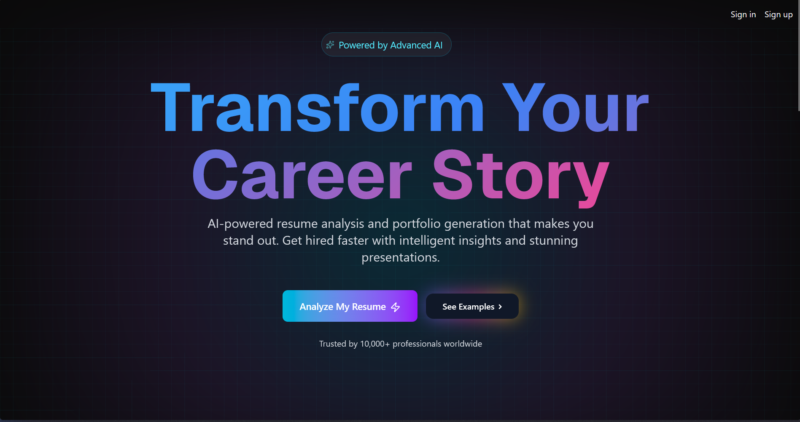

# Resuma 🚀

[](https://choosealicense.com/licenses/mit/)
[](https://nextjs.org/)
[](https://reactjs.org/)
[](https://fastapi.tiangolo.com/)
[](https://www.python.org/)

**Transform Your Career Story with AI-Powered Intelligence**

Resuma is a cutting-edge dual-stack web application that leverages advanced AI to analyze resumes, generate stunning portfolios, and provide personalized career insights. Built with Next.js frontend and FastAPI backend, powered by LangChain RAG system and Google Gemini AI, Resuma helps professionals stand out in today's competitive job market.



## ✨ Features

### 🧠 AI-Powered Interview Preparation
- **RAG-Based Resume Analysis**: Upload your resume and get intelligent answers about your skills, projects, and experience
- **Conversational AI Assistant**: Chat with an AI that understands your resume context using LangChain and vector embeddings
- **Smart Question Answering**: Get accurate, context-aware responses based on your actual resume content
- **Interview Practice**: Prepare for interviews with AI-generated questions tailored to your background
- **Session Management**: Upload, analyze, and manage multiple resume sessions

### 🎨 Portfolio Generation
- **AI-Enhanced Content**: Automatically refine and elaborate your portfolio content while maintaining factual accuracy
- **6 Premium Templates**: Choose from professionally designed templates:
  - **EmeraldShine**: Modern and vibrant design
  - **MidnightBlue**: Professional dark theme
  - **NeonFusion**: Bold and dynamic layout
  - **OceanBreeze**: Clean and calming aesthetic
  - **RoyalPurple**: Elegant and sophisticated
  - **SunsetGlow**: Warm and inviting design
- **Responsive Design**: Portfolios that look stunning on all devices
- **Public Sharing**: Share your portfolio with a unique URL (`/p/[portfolioId]`)
- **Database Storage**: All portfolios saved to Supabase for easy management

### 🚀 Career Insights
- **Resume-Based Recommendations**: AI-driven suggestions based on your actual experience
- **Skill Gap Analysis**: Identify areas for professional development
- **Project Highlighting**: Showcase your best work effectively
- **Professional Tone**: Content refined to sound confident and polished

### 📊 Dashboard Features
- **Portfolio Management**: Create, view, and delete your portfolios
- **Resume Analysis**: Upload and analyze multiple resumes
- **Interview Prep Hub**: Access your AI interview assistant
- **Settings & Customization**: Personalize your experience
- **User Authentication**: Secure access with Clerk authentication

## 🏗️ Architecture

Resuma is built as a **dual-stack application**:

### Frontend (Next.js)
- Modern React-based UI with App Router
- Server-side rendering and API routes
- Real-time portfolio preview
- Responsive design system

### Backend (FastAPI)
- RESTful API with Python
- LangChain-based RAG (Retrieval-Augmented Generation) system
- Vector embeddings with Pinecone
- PDF processing and document parsing
- AI agent with tool calling capabilities

## 🛠️ Tech Stack

### Frontend Technologies
- **Framework**: [Next.js 15.2.8](https://nextjs.org/) - React framework with App Router
- **UI Library**: [React 18.2.0](https://reactjs.org/)
- **Styling**: [Tailwind CSS 4](https://tailwindcss.com/) with custom configurations
- **Animations**: 
  - [Framer Motion 12.23.24](https://www.framer.com/motion/) - Advanced animations
  - [Animate.css 4.1.1](https://animate.style/) - CSS animations
- **Icons**: 
  - [Lucide React](https://lucide.dev/) - Modern icon library
  - [Tabler Icons React](https://tabler-icons.io/) - Additional icon set
- **UI Components**: 
  - [Radix UI](https://www.radix-ui.com/) - Accessible component primitives
  - Custom components with glassmorphism and modern design patterns
- **HTTP Client**: [Axios 1.13.2](https://axios-http.com/)
- **PDF Processing**: 
  - [pdfjs-dist 5.4.530](https://mozilla.github.io/pdf.js/)
  - [react-pdf 10.3.0](https://github.com/wojtekmaj/react-pdf)
- **File Upload**: [react-dropzone 14.3.8](https://react-dropzone.js.org/)

### Backend Technologies
- **Framework**: [FastAPI](https://fastapi.tiangolo.com/) - Modern Python web framework
- **AI/LLM**: 
  - [LangChain](https://python.langchain.com/) - LLM application framework
  - [LangChain Community](https://python.langchain.com/docs/integrations/platforms/) - Community integrations
  - [Groq](https://groq.com/) - LLM inference (llama-3.3-70b-versatile model)
- **Vector Database**: [Pinecone](https://www.pinecone.io/) - Vector storage and retrieval
- **Embeddings**: [HuggingFace](https://huggingface.co/) - all-MiniLM-L6-v2 model
- **Document Processing**: 
  - [PyPDF](https://pypdf.readthedocs.io/) - PDF parsing
  - [PyMuPDF](https://pymupdf.readthedocs.io/) - Advanced PDF processing
- **Text Splitting**: LangChain Text Splitters - Intelligent document chunking
- **Search Tools**: [DuckDuckGo Search](https://pypi.org/project/duckduckgo-search/) - Web search integration

### Services & Infrastructure
- **Authentication**: [Clerk 6.35.5](https://clerk.com/) - Complete user management
- **Database**: [Supabase](https://supabase.com/) - PostgreSQL database with real-time capabilities
- **AI Engine**: [Google Gemini AI](https://ai.google.dev/) - Portfolio content generation and refinement
- **CORS**: FastAPI CORS middleware for frontend-backend communication

### Development Tools
- **Languages**: JavaScript/JSX, TypeScript, Python 3.8+
- **Linting**: ESLint with Next.js configuration
- **Compiler**: Babel React Compiler for optimized builds
- **Styling Tools**: PostCSS with Tailwind CSS
- **Environment**: python-dotenv for configuration management

## 📋 Prerequisites

Before you begin, ensure you have the following installed:

### For Frontend:
- **Node.js** (v18 or higher)
- **npm** or **yarn** package manager

### For Backend:
- **Python** (3.8 or higher)
- **pip** package manager
- **Virtual environment** (recommended)

### General:
- **Git** for version control

## 🚀 Getting Started

### 1. Clone the Repository

```bash
git clone https://github.com/VishankhBhardwaj/Resuma.git
cd Resuma
```

### 2. Frontend Setup

#### Install Frontend Dependencies

```bash
cd resuma
npm install
# or
yarn install
```

#### Frontend Environment Setup

Create a `.env.local` file in the `resuma` directory:

```env
# Clerk Authentication
NEXT_PUBLIC_CLERK_PUBLISHABLE_KEY=your_clerk_publishable_key
CLERK_SECRET_KEY=your_clerk_secret_key

# Supabase Database
SUPABASE_URL=your_supabase_url
NEXT_PUBLIC_SUPABASE_PUBLISHABLE_KEY=your_supabase_publishable_key
SUPABASE_SERVICE_ROLE_KEY=your_supabase_service_role_key
DATABASE_PASSWORD=your_database_password

# Google Gemini AI
GEMINI_API_KEY=your_gemini_api_key
```

### 3. Backend Setup

#### Create Virtual Environment

```bash
cd ../backend
python -m venv venv

# Activate virtual environment
# On Windows:
venv\Scripts\activate
# On macOS/Linux:
source venv/bin/activate
```

#### Install Backend Dependencies

```bash
pip install -r requirements.txt
```

#### Backend Environment Setup

Create a `.env` file in the `backend` directory:

```env
# Groq LLM API
GROQ_API_KEY=your_groq_api_key

# HuggingFace Token
HF_TOKEN=your_huggingface_token

# LangChain (Optional - for tracing)
LANGCHAIN_API_KEY=your_langchain_api_key
LANGCHAIN_PROJECT=Resuma

# Pinecone Vector Database
PINECONE_API_KEY=your_pinecone_api_key

# Tavus (Optional - for video generation)
TAVUS_API_KEY=your_tavus_api_key
TAVUS_REPLICA_ID=your_replica_id
```

### 4. Getting API Keys

#### **Clerk Authentication:**
1. Sign up at [clerk.com](https://clerk.com/)
2. Create a new application
3. Copy the publishable and secret keys from the dashboard

#### **Supabase:**
1. Create an account at [supabase.com](https://supabase.com/)
2. Create a new project
3. Get your URL and keys from Project Settings → API
4. Create a table named `Portfolios` with columns:
   - `id` (text, primary key)
   - `clerk_user_id` (text)
   - `form_data` (jsonb)
   - `ai_data` (text)
   - `template` (text)
   - `created_at` (timestamp)
5. Create a table named `users` with columns:
   - `clerk_user_id` (text, primary key)
   - `analyze_count` (integer, default: 0)
   - `created_at` (timestamp)

#### **Google Gemini AI:**
1. Visit [Google AI Studio](https://ai.google.dev/)
2. Create an API key
3. Copy the key to your environment variables

#### **Groq:**
1. Sign up at [groq.com](https://groq.com/)
2. Generate an API key
3. Add to backend `.env` file

#### **Pinecone:**
1. Create account at [pinecone.io](https://www.pinecone.io/)
2. Create a new index named `resuma`
3. Set dimensions to `384` (for all-MiniLM-L6-v2 embeddings)
4. Copy your API key

#### **HuggingFace:**
1. Sign up at [huggingface.co](https://huggingface.co/)
2. Go to Settings → Access Tokens
3. Create a new token
4. Copy to backend `.env` file

### 5. Run the Application

#### Start Backend Server

```bash
cd backend
# Make sure virtual environment is activated
uvicorn main:app --reload --port 8000
```

The backend API will be available at `http://127.0.0.1:8000`

#### Start Frontend Development Server

```bash
cd resuma
npm run dev
# or
yarn dev
```

The frontend will be available at `http://localhost:3000`

### 6. Build for Production

#### Frontend Production Build

```bash
cd resuma
npm run build
npm start
# or
yarn build
yarn start
```

#### Backend Production Deployment

```bash
cd backend
uvicorn main:app --host 0.0.0.0 --port 8000
```

## 📁 Project Structure

```
Resuma/
├── backend/                    # FastAPI Backend
│   ├── main.py                # FastAPI application & endpoints
│   ├── llm.py                 # LLM configuration & retrieval chain
│   ├── rag.py                 # RAG system (embeddings, vector store)
│   ├── tools.py               # LangChain tools (interview prep)
│   ├── video_tool.py          # Video generation tool (commented)
│   ├── store.py               # Global state management
│   ├── requirements.txt       # Python dependencies
│   ├── .env                   # Backend environment variables
│   ├── uploads/               # Resume upload directory
│   └── venv/                  # Python virtual environment
│
└── resuma/                    # Next.js Frontend
    ├── public/                # Static assets
    ├── src/
    │   ├── app/              # Next.js App Router
    │   │   ├── api/          # API routes
    │   │   │   ├── ai/       # AI portfolio generation
    │   │   │   ├── portfolios/ # Portfolio CRUD
    │   │   │   ├── resume/   # Resume processing
    │   │   │   └── user/     # User management
    │   │   ├── dashboard/    # Dashboard pages
    │   │   │   ├── analyzeresumes/   # Resume analysis
    │   │   │   ├── createportfolio/  # Portfolio creation
    │   │   │   ├── interviewprep/    # AI interview assistant
    │   │   │   ├── myportfolios/     # Portfolio management
    │   │   │   └── settings/         # User settings
    │   │   ├── p/            # Public portfolio pages
    │   │   ├── layout.js     # Root layout with Clerk
    │   │   ├── page.js       # Landing page
    │   │   └── globals.css   # Global styles
    │   ├── components/       # React components
    │   │   ├── template/     # 6 Portfolio templates
    │   │   │   ├── EmeraldShine.jsx
    │   │   │   ├── MidnightBlue.jsx
    │   │   │   ├── NeonFusion.jsx
    │   │   │   ├── OceanBreeze.jsx
    │   │   │   ├── RoyalPurple.jsx
    │   │   │   └── SunsetGlow.jsx
    │   │   └── ui/           # Reusable UI components
    │   ├── hooks/            # Custom React hooks
    │   ├── lib/              # Utility functions
    │   │   ├── gemini.js     # Gemini AI integration
    │   │   └── supabase/     # Supabase client
    │   └── middleware.ts     # Next.js middleware
    ├── .env.local            # Frontend environment variables
    ├── package.json          # Frontend dependencies
    ├── tailwind.config.js    # Tailwind configuration
    └── next.config.mjs       # Next.js configuration
```

## 🎯 How It Works

### 1. **Upload Resume (Interview Prep)**
- Navigate to Interview Prep in the dashboard
- Upload your resume in PDF format
- Backend processes the PDF using PyPDF and PyMuPDF
- Document is split into chunks using RecursiveCharacterTextSplitter
- Chunks are embedded using HuggingFace all-MiniLM-L6-v2 model
- Embeddings stored in Pinecone vector database

### 2. **AI Processing (RAG System)**
- User asks a question about their resume
- LangChain agent determines if it needs the interview_prep_tool
- Question is contextualized using chat history
- Relevant resume chunks retrieved from Pinecone
- Groq LLM (llama-3.3-70b-versatile) generates answer using retrieved context
- Response returned with conversation history maintained

### 3. **Portfolio Creation**
- Fill out portfolio form with your information
- Choose from 6 premium templates
- Data sent to Google Gemini AI for content refinement
- AI elaborates descriptions while maintaining factual accuracy
- Refined portfolio saved to Supabase
- Portfolio accessible via unique URL

### 4. **Portfolio Sharing**
- Each portfolio gets a unique ID
- Access via `/p/[portfolioId]` route
- Public portfolios load data from Supabase
- Rendered using selected template component
- Fully responsive and shareable

## 🎨 Key Features in Detail

### RAG-Based Interview Preparation
- **Vector Search**: Semantic search over resume content using Pinecone
- **Context-Aware Responses**: LLM answers based on actual resume data
- **Chat History**: Maintains conversation context across questions
- **Tool Calling**: LangChain agent intelligently routes queries to appropriate tools
- **Session Management**: Upload/delete resume sessions independently

### AI Portfolio Refinement
- **Structure Preservation**: Maintains exact JSON structure for template compatibility
- **Content Enhancement**: Improves grammar, clarity, and professionalism
- **Fact Safety**: Never adds fake information or exaggerates claims
- **Professional Tone**: Converts casual language to portfolio-ready content
- **Elaboration**: Expands brief descriptions while staying truthful

### Modern UI/UX
- **Glassmorphism Design**: Modern, translucent UI elements
- **Gradient Animations**: Dynamic color transitions with Framer Motion
- **Responsive Layout**: Optimized for desktop, tablet, and mobile
- **Dark Mode Support**: Built-in theme switching with next-themes
- **Micro-interactions**: Smooth hover effects and transitions
- **Toast Notifications**: User feedback with Sonner

### Authentication & Security
- **Clerk Integration**: Secure authentication with social login support
- **Protected Routes**: Middleware-based route protection
- **User Session Management**: Persistent sessions across devices
- **API Security**: Authenticated API endpoints
- **CORS Configuration**: Secure frontend-backend communication

### Database Integration
- **Supabase PostgreSQL**: Scalable relational database
- **Real-time Capabilities**: Live data synchronization
- **Row-Level Security**: User data isolation
- **Efficient Queries**: Optimized data retrieval
- **JSON Storage**: Flexible schema for portfolio data

## 🔌 API Endpoints

### Backend (FastAPI) - Port 8000

| Endpoint | Method | Description |
|----------|--------|-------------|
| `/file_upload` | POST | Upload resume PDF and create embeddings |
| `/ai_agent` | POST | Query AI agent about resume |
| `/delete_vectors` | POST | Delete all vectors from Pinecone |

### Frontend (Next.js API Routes)

| Endpoint | Method | Description |
|----------|--------|-------------|
| `/api/ai/portfolio` | POST | Generate AI-refined portfolio |
| `/api/portfolios/Delete` | DELETE | Delete portfolio |
| `/api/resume` | POST | Process resume |
| `/api/user` | GET/POST | User management |

## 🤝 Contributing

Contributions are welcome! Please feel free to submit a Pull Request.

1. Fork the project
2. Create your feature branch (`git checkout -b feature/AmazingFeature`)
3. Commit your changes (`git commit -m 'Add some AmazingFeature'`)
4. Push to the branch (`git push origin feature/AmazingFeature`)
5. Open a Pull Request

## 📝 License

This project is licensed under the MIT License - see the [LICENSE](LICENSE) file for details.

Copyright (c) 2025 Vishankh

## 👨‍💻 Author

**Vishankh Bhardwaj**

- GitHub: [@VishankhBhardwaj](https://github.com/VishankhBhardwaj)

## 🙏 Acknowledgments

### Frontend
- [Next.js](https://nextjs.org/) - The React Framework
- [Clerk](https://clerk.com/) - Authentication and User Management
- [Supabase](https://supabase.com/) - Backend as a Service
- [Google Gemini AI](https://ai.google.dev/) - AI-Powered Portfolio Refinement
- [Radix UI](https://www.radix-ui.com/) - Accessible UI Components
- [Tailwind CSS](https://tailwindcss.com/) - Utility-First CSS Framework
- [Framer Motion](https://www.framer.com/motion/) - Animation Library

### Backend
- [FastAPI](https://fastapi.tiangolo.com/) - Modern Python Web Framework
- [LangChain](https://python.langchain.com/) - LLM Application Framework
- [Groq](https://groq.com/) - Fast LLM Inference
- [Pinecone](https://www.pinecone.io/) - Vector Database
- [HuggingFace](https://huggingface.co/) - Embeddings and Models

## 📞 Support

If you have any questions or need help, please:
- Open an issue on GitHub
- Contact the maintainer

## 🌟 Show Your Support

If you find this project helpful, please give it a ⭐️ on GitHub!

---

**Transform your career story with AI-powered intelligence.** 🚀
