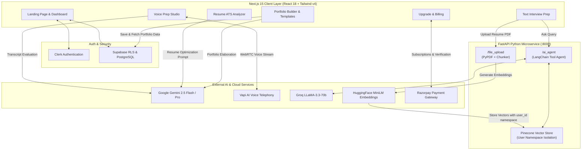

# Resuma 🚀

<div align="center">

[](https://choosealicense.com/licenses/mit/)
[](https://nextjs.org/)
[](https://reactjs.org/)
[](https://tailwindcss.com/)
[](https://fastapi.tiangolo.com/)
[](https://www.python.org/)
[](https://python.langchain.com/)
[](https://www.pinecone.io/)
[](https://ai.google.dev/)
[](https://vapi.ai/)
[](https://razorpay.com/)
[](https://clerk.com/)
[](https://supabase.com/)

**The Complete AI-Powered Career Accelerator & Portfolio Ecosystem**

*Analyze resumes with ATS intelligence, practice real-time conversational and voice mock interviews with live AI evaluators, and generate stunning designer web portfolios in seconds.*

[Key Features](#-key-features) • [System Architecture](#️-system-architecture) • [Tech Stack](#-tech-stack) • [Live Demo & Routes](#-application-modules) • [Database Schema](#-database-schema-supabase-sql) • [Getting Started](#-getting-started) • [API Reference](#-api-endpoints)

---


</div>

## 🌟 Overview

**Resuma** is an all-in-one AI career enablement platform designed to bridge the gap between job seekers and hiring standards. Combining state-of-the-art Generative AI, Retrieval-Augmented Generation (RAG), real-time speech telephony, and interactive portfolio generation, Resuma empowers candidates to optimize their resumes, practice realistic behavioral and technical interviews, and publish production-grade personal portfolios with a single click.

---

## ✨ Key Features

### 🎙️ 1. Real-Time AI Voice Mock Interview (Vapi AI + Gemini)
- **Interactive Vocal Practice**: Conduct live, low-latency audio interviews with an AI technical recruiter powered by **Vapi AI**.
- **Live Decibel Wave Visualizer**: Dynamic real-time audio frequencies with microphone mute/unmute and instant call management.
- **Real-Time Speech Transcription**: Streaming speech-to-text logging showing candidate and interviewer dialogue in real-time.
- **Automated Diagnostic Scorecard**: After ending the call, **Google Gemini** evaluates the transcript and produces:
  - **Overall Rating**: Score out of 10 with star-rated summary.
  - **Communication Skills**: Fluency, clarity, pacing, and filler-word analysis.
  - **Technical Knowledge**: Depth, accuracy, and justification of technology choices.
  - **Project Explanation**: Architectural clarity, problem-solving narrative, and technical grounding.
  - **Strengths & Areas of Improvement**: Bulleted breakdowns of what went well and what needs work.
  - **Action Plan**: Step-by-step guidance to master upcoming real-world interviews.

---

### 🧠 2. Conversational RAG Resume Assistant (Pinecone + Groq LLaMA 3.3)
- **Multi-Tenant Vector Isolation**: Resumes are vectorized and stored in Pinecone with strict user namespace isolation (`namespace=user_id`).
- **Semantic Retrieval**: Queries retrieve the top relevant semantic chunks using HuggingFace's `all-MiniLM-L6-v2` embeddings.
- **Ultra-Fast LLM Inference**: Powered by **Groq** running `llama-3.3-70b-versatile` for sub-second, highly contextual responses.
- **LangChain Tool-Calling Agent**: Incorporates smart routing between the resume retriever and **DuckDuckGo Search** for external career questions.
- **Chat History & Contextual Continuity**: Retains conversation history using `RunnableWithMessageHistory` across multiple questions.

---

### 📄 3. ATS Resume Analyzer & Keyword Matcher
- **Dual Ingestion Options**: Upload PDF resumes directly (processed client-side via `react-pdftotext`) or paste raw resume text.
- **Role & Tech-Stack Matching**: Input desired target job title, job description, and custom required skill tags.
- **Comprehensive ATS Scoring**: Generates an overall ATS score, identified strengths, missing keywords, and role-fit critique.
- **Usage Tracking**: Monitors and increments analysis usage quotas in Supabase.

---

### 🎨 4. AI Portfolio Builder & 6 Designer Showcase Templates
- **Zero-Code Builder**: Form-driven portfolio generator capturing contact details, social links, bio, work history, projects, and skills.
- **Gemini Pro Auto-Refinement**: AI elaborates brief bullet points into professional, metric-oriented descriptions while strictly adhering to factual accuracy.
- **6 Handcrafted Designer Themes**:
  1. 💎 **EmeraldShine**: Modern, vibrant green gradients with glassmorphic cards.
  2. 🌌 **MidnightBlue**: Deep cosmic navy dark theme tailored for engineers and architects.
  3. ⚡ **NeonFusion**: High-contrast cyberpunk cyber-glow aesthetic for creative developers.
  4. 🌊 **OceanBreeze**: Clean, minimalist oceanic palette with smooth layout accents.
  5. 👑 **RoyalPurple**: Elegant, sophisticated purple-to-indigo royal theme.
  6. 🌅 **SunsetGlow**: Warm amber-to-rose sunset theme with polished micro-interactions.
- **Public Shareable URLs**: Instantly published at `/p/[portfolioId]` with view tracking and responsive presentation across desktop, tablet, and mobile.
- **Instant Client-Side Export**: Integrated with `html2pdf.js` for exporting clean offline portfolio copies.

---

### 💳 5. Monetization & Subscription Billing (Razorpay)
- **Flexible Plans**:
  - **Starter Plan (Free)**: 1 Resume Analysis, 1 Public Portfolio, Standard text prep.
  - **Pro Career Plan (₹199/month)**: Unlimited resume analyses, unlimited portfolio deployments, access to all 6 premium designer templates, full access to the AI Voice Coach (Vapi AI), and comprehensive Gemini performance scorecards.
- **Secure Payments**: Integrated with Razorpay Recurring Subscriptions (`create-order`, client checkout modal, `verify`, and self-serve `cancel`).

---

### 📊 6. Analytics Dashboard & User Synchronization
- **Live Metrics**: Total portfolios deployed, cumulative public portfolio views, and total resume analyses performed.
- **User Onboarding & Clerk Sync**: Automatic user provisioning in Supabase PostgreSQL (`users` table) upon sign-in with Clerk metadata.

---

## 🏗️ System Architecture



---

## 🛠️ Tech Stack

### Frontend Ecosystem
| Technology | Version | Purpose |
|:---|:---|:---|
| **[Next.js](https://nextjs.org/)** | `15.2.8` | React framework with App Router, Server Components & API routes |
| **[React](https://reactjs.org/)** | `18.2.0` | Declarative UI component library |
| **[Tailwind CSS](https://tailwindcss.com/)** | `^4.0.0` | Modern utility-first CSS styling engine |
| **[@vapi-ai/web](https://vapi.ai/)** | `^2.6.1` | Real-time WebRTC audio client for vocal AI interviews |
| **[Framer Motion](https://www.framer.com/motion/)** | `^12.23.24` | Production-grade UI animations and physics-based transitions |
| **[@google/genai](https://ai.google.dev/)** | `^1.34.0` | Official Google Gemini SDK for client/server AI content generation |
| **[@clerk/nextjs](https://clerk.com/)** | `6.35.5` | End-to-end authentication, session security, and user profiles |
| **[@supabase/supabase-js](https://supabase.com/)** | `^2.89.0` | PostgreSQL database client with server and browser adapters |
| **[Razorpay](https://razorpay.com/)** | `^2.9.8` | Payment gateway integration for recurring subscriptions |
| **[html2pdf.js](https://github.com/eKoopmans/html2pdf.js)** | `^0.14.0` | Client-side DOM-to-PDF rendering and export |
| **[react-pdftotext](https://www.npmjs.com/package/react-pdftotext)**| `^1.3.4` | In-browser PDF text extraction without heavy native bindings |
| **[Sonner](https://sonner.emilkowal.ski/)** | `^2.0.7` | Minimalist toast notifications |
| **[Lenis](https://lenis.darkroom.engineering/)** | `^1.3.25` | Smooth page momentum scrolling |
| **[Lucide React](https://lucide.dev/)** | `^0.555.0` | Clean, modern SVG icon library |

### Backend Microservice (FastAPI & RAG Pipeline)
| Technology | Description |
|:---|:---|
| **[FastAPI](https://fastapi.tiangolo.com/)** | High-performance asynchronous Python web framework |
| **[Uvicorn](https://www.uvicorn.org/)** | ASGI server implementation for lightning-fast request handling |
| **[LangChain](https://python.langchain.com/)** | Framework for developing LLM applications and agent tool calling |
| **[LangChain Groq](https://github.com/langchain-ai/langchain-groq)** | High-throughput LLM inference for `llama-3.3-70b-versatile` |
| **[LangChain Pinecone](https://python.langchain.com/docs/integrations/vectorstores/pinecone/)** | Vector storage and similarity search with namespace isolation |
| **[HuggingFace Hub](https://huggingface.co/)** | Embeddings generation (`sentence-transformers/all-MiniLM-L6-v2`) |
| **[PyPDF](https://pypdf.readthedocs.io/)** | Server-side PDF document ingestion and text extraction |
| **[DuckDuckGo Search (`ddgs`)](https://pypi.org/project/duckduckgo-search/)** | Fallback search tool for general market & career questions |

---

## 📁 Repository Structure

```
Resuma/
├── backend/                             # Python FastAPI RAG Microservice
│   ├── uploads/                         # Temporary PDF ingestion directory
│   ├── .env                             # Backend environment variables
│   ├── llm.py                           # Groq LLM & LangChain Conversational Retrieval Chain
│   ├── main.py                          # FastAPI endpoints, CORS, & Agent Executor
│   ├── rag.py                           # Pinecone vector store & user namespace management
│   ├── requirements.txt                 # Python dependencies
│   ├── runtime.txt                      # Target Python runtime version
│   ├── store.py                         # In-memory session store helper
│   └── tools.py                         # Custom LangChain tools with chat history
│
└── resuma/                              # Next.js 15 Full-Stack Web Application
    ├── public/                          # Static assets, banners, icons
    ├── src/
    │   ├── app/                         # Next.js App Router
    │   │   ├── api/                     # Serverless API routes
    │   │   │   ├── ai/portfolio/        # Gemini portfolio auto-refinement
    │   │   │   ├── analyze-count/       # Resume analyze usage increment
    │   │   │   ├── dashboard-stats/     # Aggregated user stats (views, counts)
    │   │   │   ├── payment/             # Razorpay create-order, verify, cancel
    │   │   │   ├── portfolios/          # Portfolio CRUD endpoints
    │   │   │   ├── resume/              # Resume ATS analysis route
    │   │   │   ├── user/                # User profile & subscription status
    │   │   │   ├── usersync/            # Clerk webhook database sync
    │   │   │   └── voiceprep/getFeedback# Gemini voice transcript performance review
    │   │   ├── dashboard/               # Authenticated Dashboard Pages
    │   │   │   ├── analyzeresumes/      # ATS resume optimization page
    │   │   │   ├── createportfolio/     # Step-by-step portfolio generator
    │   │   │   ├── interviewprep/       # Conversational RAG interview assistant
    │   │   │   ├── myportfolios/        # Manage, edit, view, delete portfolios
    │   │   │   ├── settings/            # User account settings
    │   │   │   ├── upgrade/             # Pricing & Razorpay subscription upgrade
    │   │   │   ├── voiceprep/           # Real-time Vapi AI voice interview coach
    │   │   │   ├── layout.js            # Dashboard sidebar & topbar layout
    │   │   │   └── page.js              # Dashboard metrics & quick actions
    │   │   ├── p/[portfolioId]/         # Publicly shareable dynamic portfolio page
    │   │   ├── globals.css              # Global styles & Tailwind CSS v4 imports
    │   │   ├── layout.js                # Root layout wrapped in ClerkProvider
    │   │   └── page.js                  # Modern landing page with animations
    │   ├── components/
    │   │   ├── template/                # 6 Handcrafted Portfolio Templates
    │   │   │   ├── EmeraldShine.jsx     # Modern emerald & mint gradient
    │   │   │   ├── MidnightBlue.jsx     # Dark cybernetic navy
    │   │   │   ├── NeonFusion.jsx       # Vibrant high-contrast neon
    │   │   │   ├── OceanBreeze.jsx      # Clean minimal ocean blue
    │   │   │   ├── RoyalPurple.jsx      # Sophisticated imperial purple
    │   │   │   └── SunsetGlow.jsx       # Warm sunset amber & rose
    │   │   └── ui/                      # Reusable UI primitives (buttons, dialogs, sidebar)
    │   ├── hooks/                       # Custom React hooks
    │   └── lib/                         # Utility libraries
    │       ├── gemini.js                # Gemini API integration helper
    │       ├── razorpay.js              # Razorpay server instance
    │       └── supabase/                # Supabase client & server singletons
    ├── .env.local                       # Frontend environment variables
    ├── components.json                  # UI component configuration
    ├── package.json                     # Frontend dependencies & scripts
    └── tailwind.config.js               # Tailwind design system configuration
```

---

## 🗄️ Database Schema (Supabase SQL)

Run the following SQL migration in your **Supabase SQL Editor** to initialize all required tables, relations, and indexes:

```sql
-- 1. Users Table
CREATE TABLE IF NOT EXISTS public.users (
    id UUID PRIMARY KEY DEFAULT gen_random_uuid(),
    clerk_user_id TEXT UNIQUE NOT NULL,
    "fullName" TEXT,
    email TEXT,
    avatar_url TEXT,
    is_premium BOOLEAN DEFAULT FALSE,
    analyze_count INTEGER DEFAULT 0,
    created_at TIMESTAMP WITH TIME ZONE DEFAULT NOW()
);

-- 2. Portfolios Table
CREATE TABLE IF NOT EXISTS public."Portfolios" (
    id TEXT PRIMARY KEY,
    clerk_user_id TEXT NOT NULL,
    form_data JSONB NOT NULL,
    ai_data JSONB,
    template TEXT NOT NULL DEFAULT 'EmeraldShine',
    views INTEGER DEFAULT 0,
    created_at TIMESTAMP WITH TIME ZONE DEFAULT NOW()
);

-- 3. Subscriptions Table
CREATE TABLE IF NOT EXISTS public.subscriptions (
    id UUID PRIMARY KEY DEFAULT gen_random_uuid(),
    user_id UUID REFERENCES public.users(id) ON DELETE CASCADE,
    razorpay_subscription_id TEXT NOT NULL,
    plan_id TEXT NOT NULL,
    plan_name TEXT DEFAULT 'PREMIUM_MONTHLY',
    status TEXT DEFAULT 'PENDING',
    created_at TIMESTAMP WITH TIME ZONE DEFAULT NOW()
);

-- Performance Indexes
CREATE INDEX IF NOT EXISTS idx_users_clerk_id ON public.users(clerk_user_id);
CREATE INDEX IF NOT EXISTS idx_portfolios_clerk_user_id ON public."Portfolios"(clerk_user_id);
CREATE INDEX IF NOT EXISTS idx_subscriptions_user_id ON public.subscriptions(user_id);
```

---

## 🚀 Getting Started

### 📋 Prerequisites
- **Node.js**: `v18.17.0` or higher
- **Python**: `v3.10` or higher
- **Package Managers**: `npm` (or `yarn` / `pnpm`) and `pip`
- **Git**: For version control

---

### 1️⃣ Clone the Repository
```bash
git clone https://github.com/VishankhBhardwaj/Resuma.git
cd Resuma
```

---

### 2️⃣ Backend Setup (FastAPI RAG Service)

1. Navigate to the `backend` folder:
   ```bash
   cd backend
   ```

2. Create and activate a Python virtual environment:
   ```bash
   # Windows (PowerShell):
   python -m venv venv
   .\venv\Scripts\activate

   # macOS / Linux:
   python3 -m venv venv
   source venv/bin/activate
   ```

3. Install required Python packages:
   ```bash
   pip install -r requirements.txt
   ```

4. Configure backend environment variables:
   Create a `.env` file in the `backend/` directory:
   ```env
   # Groq LLM API Key (https://console.groq.com)
   GROQ_API_KEY="your_groq_api_key_here"

   # HuggingFace Token (https://huggingface.co/settings/tokens)
   HF_TOKEN="your_huggingface_token_here"

   # Pinecone Vector Database (https://www.pinecone.io)
   PINECONE_API_KEY="your_pinecone_api_key_here"

   # Optional LangChain Observability
   LANGCHAIN_API_KEY="your_langchain_api_key"
   LANGCHAIN_PROJECT="Resuma"
   ```

   > [!NOTE]
   > Ensure you have created an index named **`resuma`** in Pinecone with **`384` dimensions** and **Cosine** metric (matching `sentence-transformers/all-MiniLM-L6-v2`).

5. Start the backend development server:
   ```bash
   uvicorn main:app --reload --port 8000
   ```
   The backend API will be live at `http://localhost:8000` (Swagger docs at `http://localhost:8000/docs`).

---

### 3️⃣ Frontend Setup (Next.js 15)

1. Open a new terminal and navigate to the `resuma` directory:
   ```bash
   cd resuma
   ```

2. Install Node dependencies:
   ```bash
   npm install
   ```

3. Configure frontend environment variables:
   Create a `.env.local` file in the `resuma/` directory:
   ```env
   # Clerk Authentication (https://clerk.com)
   NEXT_PUBLIC_CLERK_PUBLISHABLE_KEY=pk_test_your_clerk_key
   CLERK_SECRET_KEY=sk_test_your_clerk_secret

   # Supabase Database (https://supabase.com)
   SUPABASE_URL=https://your-project.supabase.co
   NEXT_PUBLIC_SUPABASE_PUBLISHABLE_KEY=your_supabase_anon_key
   SUPABASE_SERVICE_ROLE_KEY=your_supabase_service_role_key
   DATABASE_PASSWORD=your_database_password

   # Google Gemini AI (https://ai.google.dev/)
   GEMINI_API_KEY=your_gemini_api_key

   # Vapi AI Voice Agent (https://vapi.ai)
   NEXT_PUBLIC_VAPI_PUBLIC_KEY=your_vapi_public_key
   NEXT_PUBLIC_VAPI_ASSISTANT_ID=your_vapi_assistant_id

   # Razorpay Payment Gateway (https://dashboard.razorpay.com)
   RAZORPAY_KEY_ID=rzp_test_your_key_id
   RAZORPAY_SECRET=your_razorpay_secret
   RAZORPAY_PLAN_ID=plan_your_plan_id

   # Python Backend URL (Local or Deployed)
   NEXT_PUBLIC_BACKEND_URL=http://localhost:8000
   ```

4. Run the frontend development server:
   ```bash
   npm run dev
   ```
   Open `http://localhost:3000` in your browser to access Resuma!

---

## 🔌 API Endpoints

### 🐍 FastAPI Microservice (`http://localhost:8000`)

| Endpoint | Method | Request Body / Form | Description |
|:---|:---:|:---|:---|
| `/file_upload` | `POST` | `file`: PDF binary, `user_id`: string | Splits PDF into chunks, computes HuggingFace embeddings, and indexes into Pinecone under `user_id` namespace. |
| `/ai_agent` | `POST` | `query`: string, `user_id`: string | Executes conversational agent with `interview_prep_tool` and web search fallback to answer user queries. |

---

### ⚡ Next.js API Routes (`/api/*`)

| Endpoint | Method | Purpose |
|:---|:---:|:---|
| `/api/ai/portfolio` | `POST` | Passes user profile info to Google Gemini for content enhancement and returns refined JSON. |
| `/api/resume` | `POST` | Performs ATS resume analysis against job title, description, and required skill tags. |
| `/api/voiceprep/getFeedback` | `POST` | Evaluates full Vapi voice interview transcript using Gemini to output multi-metric performance review. |
| `/api/portfolios` | `POST` / `GET` | Creates new portfolio entries or fetches user portfolios. |
| `/api/portfolios/Delete` | `DELETE` | Removes a portfolio record from Supabase. |
| `/api/dashboard-stats` | `GET` | Returns aggregated metrics (total portfolios, total views, resume analyses). |
| `/api/user` | `GET` | Fetches or lazily initializes user profile and subscription status. |
| `/api/analyze-count` | `POST` | Increments user's resume analysis count. |
| `/api/payment/create-order` | `POST` | Creates a Razorpay recurring subscription order for Pro plan. |
| `/api/payment/verify` | `POST` | Verifies Razorpay payment signature and updates user status to `is_premium = true`. |
| `/api/payment/cancel` | `POST` | Cancels an active Razorpay subscription. |

---

## 🎨 Portfolio Themes Showcase

Resuma includes 6 customizable, production-ready portfolio templates:

| Template Name | Style & Aesthetic | Best Suited For |
|:---|:---|:---|
| **EmeraldShine** | Vibrant emerald greens, gradient accents, modern glassmorphism | Full-Stack & Frontend Developers |
| **MidnightBlue** | Deep dark theme, slate cards, high contrast typography | Backend Engineers & DevOps Specialists |
| **NeonFusion** | Cyberpunk neon highlights, electric glow, bold cards | Creative Tech & Game Developers |
| **OceanBreeze** | Minimalist blue & cyan gradients, airy spacing | Product Managers & UI/UX Designers |
| **RoyalPurple** | Luxurious royal purple & indigo themes | Mobile Engineers & AI/ML Practitioners |
| **SunsetGlow** | Warm sunset hues, amber tones, smooth hover states | Data Scientists & Tech Consultants |

---

## 🚢 Production Deployment

### Frontend (Vercel)
1. Push your code to a GitHub repository.
2. Import the project in [Vercel](https://vercel.com/).
3. Set the **Root Directory** to `resuma`.
4. Add all environment variables from `.env.local` to Vercel's Environment Variables settings.
5. Deploy!

### Backend (Render / Railway / VPS)
1. Create a Web Service on [Render](https://render.com/) or [Railway](https://railway.app/).
2. Set the **Root Directory** to `backend`.
3. Set the **Build Command** to `pip install -r requirements.txt`.
4. Set the **Start Command** to:
   ```bash
   uvicorn main:app --host 0.0.0.0 --port $PORT
   ```
5. Add all backend environment variables (`GROQ_API_KEY`, `PINECONE_API_KEY`, `HF_TOKEN`).
6. Update `NEXT_PUBLIC_BACKEND_URL` in your frontend environment with the live backend URL.

---

## 🤝 Contributing

Contributions make the open-source community an inspiring place to learn and build:

1. Fork the Project
2. Create your Feature Branch (`git checkout -b feature/AmazingFeature`)
3. Commit your Changes (`git commit -m 'Add some AmazingFeature'`)
4. Push to the Branch (`git push origin feature/AmazingFeature`)
5. Open a Pull Request

---

## 📝 License

Distributed under the **MIT License**. See the [LICENSE](LICENSE) file for more information.

```
Copyright (c) 2025 Vishankh Bhardwaj
```

---

## 👨‍💻 Author

**Vishankh Bhardwaj**
- GitHub: [@VishankhBhardwaj](https://github.com/VishankhBhardwaj)

---

<div align="center">

**Accelerate your career journey with the intelligence of Resuma.** 🚀

*If you found this project helpful, please consider giving it a ⭐ on GitHub!*

</div>
